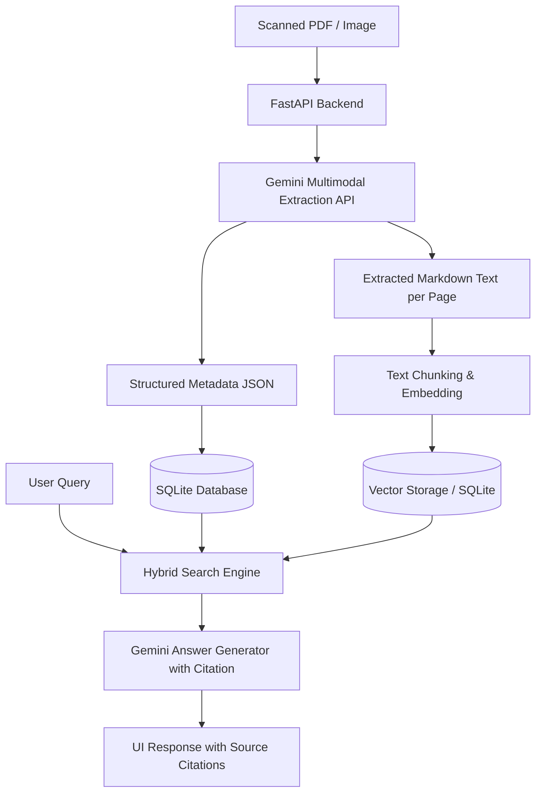
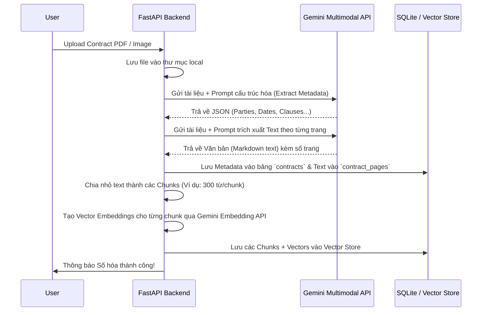

# Hướng dẫn Thiết kế & Triển khai: The Digital Contract Hub (Problem 2)

Chào bạn! Với vai trò là Mentor, tôi sẽ hướng dẫn bạn chi tiết từ tư duy thiết kế, kiến trúc hệ thống đến lộ trình triển khai chi tiết cho bài toán **Digital Contract Hub** (Hệ thống Quản lý và Truy vấn Hợp đồng Số).

Hệ thống này nhằm mục đích số hóa các hợp đồng bản cứng (dạng scan PDF hoặc ảnh chụp) thành cơ sở dữ liệu có cấu trúc, cho phép tìm kiếm lai (Hybrid Search) và hỏi đáp thông minh (RAG) kèm trích dẫn nguồn chính xác từng trang và điều khoản.

---

## 1. Phân tích Yêu cầu đề bài & Chỉ số KPI

Để xây dựng một giải pháp xuất sắc, chúng ta cần bám sát các chỉ số đánh giá (Evaluation Criteria) mà OnPoint đề ra:
*   **Độ chính xác OCR & Parsing trên các trường khóa (parties, dates, amounts) > 99%:** Đây là yêu cầu cực kỳ cao. Nếu sử dụng các công cụ OCR truyền thống như Tesseract kết hợp với Regular Expression để bóc tách thông tin, bạn sẽ rất khó đạt mức > 99% do cấu trúc hợp đồng đa dạng và chất lượng file scan/chụp không đồng đều.
*   **Retrieval Precision@3 > 90%:** Khi người dùng hỏi một câu hỏi, hệ thống RAG phải tìm đúng top 3 đoạn văn bản chứa câu trả lời với độ chính xác trên 90%.
*   **Trích dẫn nguồn (Source Citation):** Bắt buộc. Mọi câu trả lời từ hệ thống hỏi đáp phải chỉ rõ thông tin được lấy từ điều khoản nào (Clause/Section) và trang số mấy (Page).
*   **Độ phủ trích xuất điều khoản (Clause extraction recall) > 85%:** Nhận diện đúng loại điều khoản (loại hợp đồng, ngày gia hạn, luật áp dụng, v.v.).

---

## 2. Kiến trúc Giải pháp Tối ưu (Architectural Design)

Để đáp ứng các KPI khắt khe trên mà không làm phức tạp hóa hệ thống, chúng ta sẽ áp dụng kiến trúc hiện đại tận dụng tối đa sức mạnh của **Gemini Multimodal API**:



### Vì sao Gemini Multimodal là "Vũ khí tối thượng" cho bài toán này?
1.  **Hỗ trợ PDF trực tiếp:** Gemini có khả năng đọc hiểu trực tiếp tệp PDF đa trang hoặc hình ảnh chất lượng thấp. Khả năng nhận diện chữ viết và bố cục (layout-aware OCR) của Gemini vượt trội hơn hẳn so với Tesseract.
2.  **Structured Output (JSON Mode):** Chúng ta có thể bắt Gemini trả về dữ liệu trích xuất chính xác theo định dạng JSON định sẵn (thông qua Pydantic hoặc cấu trúc schema). Điều này đảm bảo độ chính xác bóc tách các trường khóa đạt mức gần như tuyệt đối (>99%).
3.  **Tích hợp Ngữ cảnh và RAG cực tốt:** Khả năng hiểu ngữ cảnh dài (Long-context window) giúp Gemini không chỉ tìm kiếm từ khóa mà còn hiểu được ý nghĩa sâu xa của các điều khoản luật pháp phức tạp.

---

## 3. Thiết kế Cơ sở Dữ liệu (Database Design)

Để phục vụ tìm kiếm lai (Hybrid Search) cả theo trường dữ liệu (Metadata filtering) và tìm kiếm ngữ nghĩa (Semantic search), chúng ta sẽ sử dụng **SQLite** làm cơ sở dữ liệu chính. SQLite vô cùng nhẹ, chạy độc lập không cần cài đặt server phức tạp trên Windows, rất phù hợp cho một bản POC (Proof of Concept).

### Sơ đồ Bảng SQLite (SQL Schema)

1.  **Bảng `contracts` (Lưu thông tin chung của hợp đồng):**
    ```sql
    CREATE TABLE contracts (
        id VARCHAR(50) PRIMARY KEY,
        file_name VARCHAR(255) NOT NULL,
        file_path VARCHAR(500) NOT NULL,
        party_a VARCHAR(255),
        party_b VARCHAR(255),
        contract_type VARCHAR(100),        -- NDA, Service, Purchase, Lease...
        effective_date DATE,
        expiration_date DATE,
        renewal_notice_days INT,           -- Số ngày báo trước khi gia hạn/chấm dứt
        total_value DECIMAL(15, 2),
        currency VARCHAR(10),
        governing_law VARCHAR(100),
        status VARCHAR(50) DEFAULT 'Active', -- Active, Expired, Terminated
        uploaded_at TIMESTAMP DEFAULT CURRENT_TIMESTAMP
    );
    ```

2.  **Bảng `contract_pages` (Lưu text thô theo từng trang để phục vụ RAG và Citation):**
    ```sql
    CREATE TABLE contract_pages (
        id INTEGER PRIMARY KEY AUTOINCREMENT,
        contract_id VARCHAR(50),
        page_number INT,
        page_text TEXT,
        FOREIGN KEY(contract_id) REFERENCES contracts(id) ON DELETE CASCADE
    );
    ```

3.  **Bảng `contract_chunks` (Lưu các đoạn text nhỏ kèm Vector Embeddings để tìm kiếm ngữ nghĩa):**
    *Nếu dùng SQLite thuần, bạn có thể lưu Vector Embeddings dưới dạng BLOB hoặc sử dụng thư viện `sqlite-vss` / `sqlite-vec`.*
    *Cách đơn giản nhất cho bản POC Python:* Sử dụng một cơ sở dữ liệu vector siêu nhẹ như **ChromaDB** hoặc **FAISS** chạy local song song với SQLite, hoặc chỉ đơn giản là lưu Vector trong bộ nhớ (In-memory) nếu số lượng hợp đồng ít.

---

## 4. Xây dựng Pipeline xử lý hợp đồng (Processing Pipeline)

Quy trình xử lý khi người dùng tải lên một tài liệu hợp đồng mới:



---

## 5. Thiết kế Prompt mẫu cho Gemini

Đây là các prompt cốt lõi giúp bạn đạt được hiệu quả bóc tách cao nhất:

### Prompt 1: Trích xuất thông tin cấu trúc (Metadata Extraction)
Chúng ta sẽ yêu cầu Gemini trả về JSON có cấu trúc. Ví dụ prompt:
```text
Bạn là một chuyên gia pháp lý và kiểm toán hợp đồng chuyên nghiệp. Hãy đọc hợp đồng được đính kèm và trích xuất các thông tin sau dưới dạng JSON. 
Yêu cầu tuyệt đối tuân thủ định dạng JSON được cung cấp, không trả về định dạng markdown hay bất kỳ từ giải thích nào ngoài chuỗi JSON.

Định dạng JSON yêu cầu:
{
  "party_a": "Tên pháp nhân bên A",
  "party_b": "Tên pháp nhân bên B",
  "contract_type": "Loại hợp đồng (NDA, Service Agreement, Lease Agreement, v.v.)",
  "effective_date": "Ngày hiệu lực (Định dạng YYYY-MM-DD, nếu không có để null)",
  "expiration_date": "Ngày hết hạn (Định dạng YYYY-MM-DD, nếu không có để null)",
  "renewal_notice_days": 90, // Số ngày cần thông báo trước khi tự động gia hạn hoặc chấm dứt (dạng số, nếu không có để null)
  "total_value": 150000000.00, // Giá trị hợp đồng (dạng số thực, nếu không có hoặc không cố định để null)
  "currency": "VND", // Loại tiền tệ (VND, USD, v.v., nếu không có để null)
  "governing_law": "Luật áp dụng (Ví dụ: Việt Nam, Singapore, v.v.)",
  "key_clauses": [
    {
      "clause_type": "Loại điều khoản (Ví dụ: Termination, Penalty, Confidentiality, Dispute Resolution)",
      "section_title": "Tên tiêu đề điều khoản trong văn bản (Ví dụ: Điều 8. Chấm dứt hợp đồng)",
      "page_number": 3, // Trang chứa điều khoản này (đánh số từ 1)
      "summary": "Tóm tắt ngắn gọn nội dung cốt lõi của điều khoản này"
    }
  ]
}
```

### Prompt 2: Trích xuất nội dung văn bản kèm số trang
Để phục vụ tính năng Citation (Trích dẫn nguồn chính xác đến từng trang), bạn có thể gửi tài liệu cho Gemini và yêu cầu:
```text
Hãy đọc hợp đồng đính kèm và trích xuất toàn bộ văn bản thô (raw text) của từng trang. 
Phân chia kết quả đầu ra rõ ràng theo định dạng sau cho từng trang:
--- PAGE_1 ---
[Toàn bộ text của trang 1 ở đây]
--- PAGE_2 ---
[Toàn bộ text của trang 2 ở đây]
```
Sau đó, trong code Python, bạn dùng regex cắt chuỗi theo `--- PAGE_X ---` để lưu văn bản tương ứng vào bảng `contract_pages`.

---

## 6. Xây dựng Hỏi đáp RAG kèm Trích dẫn (Citation QA Engine)

Khi người dùng hỏi: *"Khi nào hợp đồng với công ty X hết hạn và cần báo trước bao nhiêu ngày để chấm dứt?"*

### Thuật toán Tìm kiếm Lai (Hybrid Search):
1.  **Bước 1: Trích xuất thực thể (Entity Extraction):** Sử dụng LLM để nhận diện thực thể trong câu hỏi (Ví dụ: Tên công ty: `Công ty X`).
2.  **Bước 2: Tìm kiếm Siêu dữ liệu (Metadata Query):** Query SQL tìm các hợp đồng liên quan đến `Công ty X` để lấy danh sách `contract_id`.
3.  **Bước 3: Tìm kiếm Ngữ nghĩa (Semantic Search):**
    *   Tạo vector embedding cho câu hỏi của người dùng bằng `text-embedding-004`.
    *   Truy vấn các chunks có độ tương đồng cosine cao nhất thuộc về các `contract_id` ở bước 2.
    *   Lấy top 3 - 5 chunks liên quan nhất kèm theo thông tin `page_number` và `clause_type` đã được gắn tag lúc tạo chunk.
4.  **Bước 4: Sinh câu trả lời kèm Trích dẫn (Citation Prompt):**
    Gửi câu hỏi và các chunks tìm được sang Gemini với Prompt sau:

```text
Bạn là một trợ lý pháp lý ảo. Dưới đây là các đoạn văn bản (chunks) được trích xuất từ các hợp đồng liên quan đến câu hỏi của người dùng:

[BẮT ĐẦU VĂN BẢN TRÍCH DẪN]
--- CHUNK 1 (File: {file_name}, Trang: {page_number}, Điều khoản: {section_title}) ---
{chunk_text}

--- CHUNK 2 (File: {file_name}, Trang: {page_number}, Điều khoản: {section_title}) ---
{chunk_text}
[KẾT THÚC VĂN BẢN TRÍCH DẪN]

Câu hỏi của người dùng: {user_query}

Hãy trả lời câu hỏi một cách chính xác dựa trên thông tin được cung cấp ở trên. 
YÊU CẦU QUAN TRỌNG:
1. Bạn phải trích dẫn nguồn cho mọi thông tin bạn đưa ra dưới định dạng: [Tên File, Trang X, Section Y]. 
   Ví dụ: "Hợp đồng với Công ty X sẽ hết hạn vào ngày 31/12/2026 [HopDong_X.pdf, Trang 4, Điều 12.1]."
2. Nếu thông tin không có trong văn bản trích dẫn, hãy nói rõ "Tôi không tìm thấy thông tin này trong hợp đồng". Không tự ý bịa đặt thông tin.
```

---

## 7. Giao diện Người dùng (UI/UX) - Premium Glassmorphic Design

Giao diện sẽ được thiết kế theo phong cách tối giản hiện đại (như Problem 1) để tạo cảm giác chuyên nghiệp cho các phòng ban Pháp lý/Kế toán:

*   **Dashboard Hợp đồng:** Hiển thị danh sách các hợp đồng dưới dạng bảng thông tin trực quan (Bên A, Bên B, Loại hợp đồng, Giá trị, Ngày hết hạn, Trạng thái: Đang hiệu lực/Sắp hết hạn dưới 90 ngày).
*   **Trang Chi tiết Hợp đồng:** Khi click vào một hợp đồng, hiển thị chi tiết các thông tin siêu dữ liệu bóc tách được và có danh sách các điều khoản cốt lõi (Termination, Penalty, v.v.). Người dùng có thể click vào điều khoản để nhảy thẳng tới trang PDF tương ứng.
*   **Hộp thoại Hỏi đáp Thông minh (Contract AI Assistant):** Thiết kế dạng ô chat. Các câu trả lời của AI sẽ có các đường link trích dẫn màu sắc (Ví dụ: `[HopDong_A.pdf, Trang 3]`). Khi người dùng rê chuột hoặc click vào link, hệ thống sẽ mở file PDF và cuộn trực tiếp tới trang số 3 để đối chiếu nguồn gốc.

---

## 8. Lộ trình Triển khai Chi tiết (Step-by-step Execution Roadmap)

Để thực hiện dự án này một cách có cấu trúc nhất, bạn nên làm theo 6 bước sau:

### Bước 1: Khởi tạo Cấu trúc Dự án
Tạo thư mục `Problem_2_The_Digital_Contract_Hub` với cấu trúc:
```text
Problem_2_The_Digital_Contract_Hub/
├── backend/
│   ├── main.py             # FastAPI entrypoint & WebSocket/HTTP endpoints
│   ├── database.py         # SQLite connection & schemas
│   ├── parser.py           # Bộ trích xuất sử dụng Gemini API
│   ├── rag_engine.py       # RAG pipeline, embedding & retrieval logic
│   └── requirements.txt    # Thư viện sử dụng
├── frontend/
│   ├── index.html          # Trang chủ Dashboard & Chat RAG
│   ├── app.js              # Xử lý sự kiện, gọi API, hiển thị PDF
│   └── style.css           # CSS styling (Glassmorphism)
├── storage/                # Lưu trữ file PDF tải lên và SQLite DB file
└── README.md
```

### Bước 2: Viết mã nguồn Parser (`backend/parser.py`)
Cài đặt thư viện `google-generativeai` để gửi PDF trực tiếp tới Gemini 2.0 Flash để trích xuất JSON. Sử dụng tính năng Structured Outputs của Gemini để đảm bảo độ chính xác >99%.

### Bước 3: Thiết lập SQLite & Vector Store (`backend/database.py` & `backend/rag_engine.py`)
*   Viết code kết nối SQLite để lưu thông tin hợp đồng sau khi phân tách từ JSON của Gemini.
*   Sử dụng thư viện Vector đơn giản để lưu trữ embeddings (bạn có thể lưu file nhị phân FAISS local hoặc dùng ChromaDB để tiện truy vấn).

### Bước 4: Hoàn thiện RAG Engine
*   Viết hàm chunking phân mảnh văn bản hợp đồng từ bảng `contract_pages`.
*   Viết hàm tìm kiếm lai (Hybrid Search) kết hợp lọc SQL Metadata và tính tương đồng Vector.
*   Viết Prompt tạo phản hồi kèm trích nguồn.

### Bước 5: Viết API Backend FastAPI (`backend/main.py`)
Định nghĩa các endpoint chính:
*   `POST /api/contracts/upload`: Nhận file PDF/ảnh, chạy parser, lưu DB, tạo vector chunks.
*   `GET /api/contracts`: Lấy danh sách hợp đồng (hỗ trợ phân trang, tìm kiếm theo tên, bộ lọc ngày).
*   `POST /api/chat/query`: Nhận câu hỏi, chạy RAG Engine, trả về câu trả lời kèm trích dẫn chi tiết.

### Bước 6: Xây dựng Giao diện Frontend hiện đại
*   Thiết kế giao diện đẹp mắt bằng HTML/CSS/JS thuần.
*   Tích hợp thư viện hiển thị PDF như `pdf.js` của Mozilla để khi người dùng click vào trích dẫn nguồn (ví dụ: Trang 3), hệ thống sẽ mở trực tiếp trang 3 của PDF đó bên cạnh cửa sổ chat.

---

### Hành động Tiếp theo:
Bạn thấy bản kế hoạch thiết kế và hướng dẫn này thế nào? Chúng ta nên bắt đầu bằng việc **khởi tạo cấu trúc dự án (Bước 1) và cài đặt cơ sở dữ liệu SQLite (Bước 2)** chứ? 

Nếu bạn đồng ý, hãy cho tôi biết và tôi sẽ bắt đầu chuẩn bị mã nguồn cơ bản cho các phần này để bạn tham khảo và triển khai ngay lập tức!
